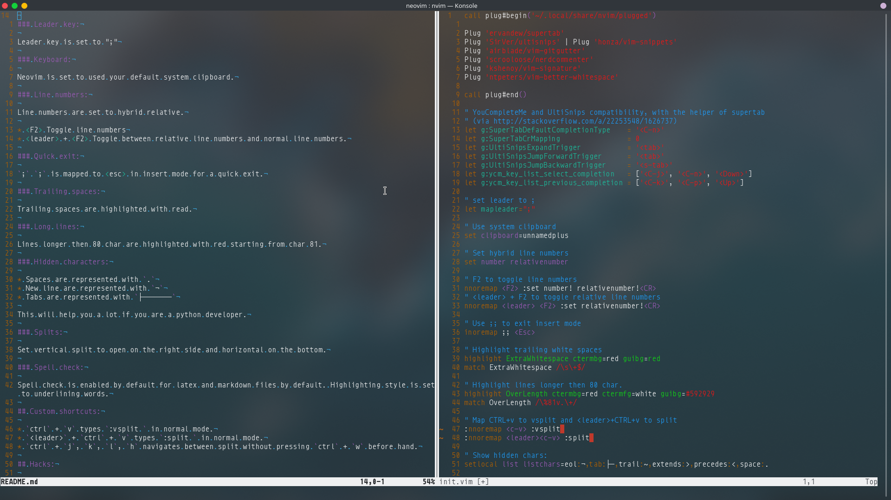

# My neovim config

## How to install:

Install [vim-plug for neovim](https://github.com/junegunn/vim-plug#neovim)

Copy `init.vim` to `~/.config/nvim/init.vim` then open NeoVim and install plugins by typing `:PlugInstall`

## Features:

### Plugin list:

* Valloric/YouCompleteMe
* junegunn/fzf.vim
* ervandew/supertab
* SirVer/ultisnips
* honza/vim-snippets
* airblade/vim-gitgutter
* scrooloose/nerdcommenter
* kshenoy/vim-signature
* ntpeters/vim-better-whitespace

### Leader key:

Leader key is set to `;`

### Clipboard:

Neovim is set to used your default system clipboard.

### Line numbers:

Line numbers are set to hybrid relative.

* `<F2>` Toggle line numbers
* `<leader>` + `<F2>` Toggle between relative line numbers and normal line numbers.

### Quick exit:

`;` + `;` is mapped to <esc> in insert mode for a quick exit.

### Trailing spaces:

Trailing spaces are highlighted with read.

### Long lines:

Lines longer then 80 char are highlighted with red starting from char 81.

### Hidden characters:

* Spaces are represented with `.`
* New line are represented with `¬`
* Tabs are represented with `├───────`

This will help you a lot if you are a python developer.

### Splits:

Set vertical split to open on the right side and horizontal on the bottom.

### Spell check:

Spell check is enabled by default for latex and markdown files by default. Highlighting style is set to underlining words.

## Custom shortcuts:

* `ctrl` + `v` types `:vsplit ` in normal mode.
* `<leader>` + `ctrl` + `v` types `:split ` in normal mode.
* `ctrl` + `j`, `k`, `l`, `h` navigates between split without pressing `ctrl` + `w` before hand.
* `ctrl` + `p` open fzf file search

## Hacks:

All plugins are installed using [vim-plug](https://github.com/junegunn/vim-plug)

[YouCompleteMe](https://github.com/Valloric/YouCompleteMe) plugin is installed externally because it require external library to function correctly.

## Thanks

* Vim creators
* NeoVim creators
* Plugin developers

Thanks for the amazing work :)

